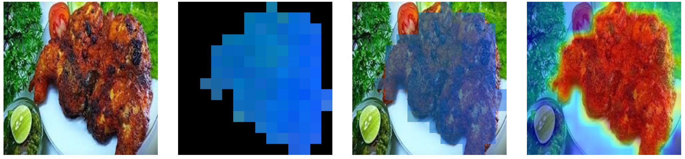
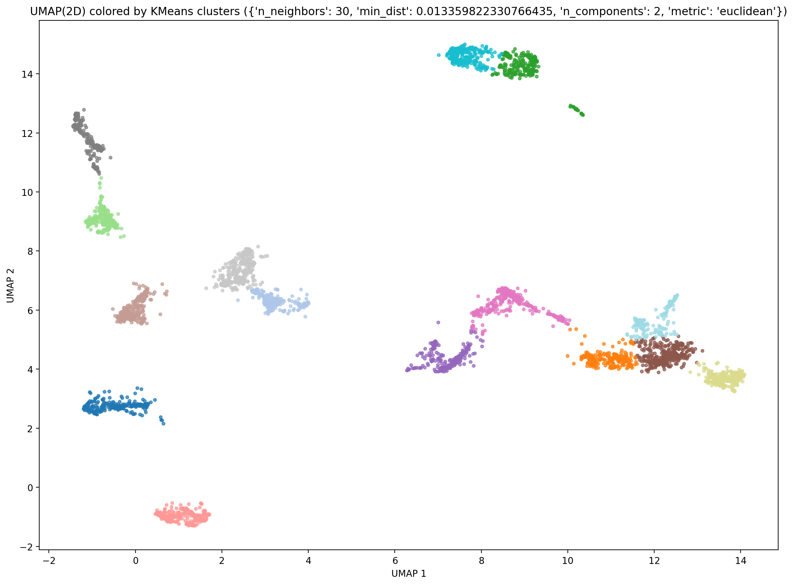
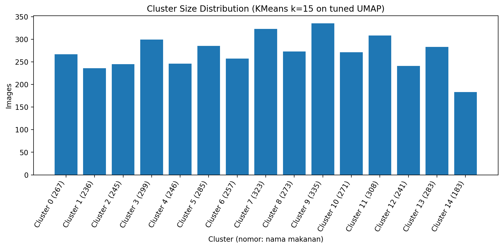
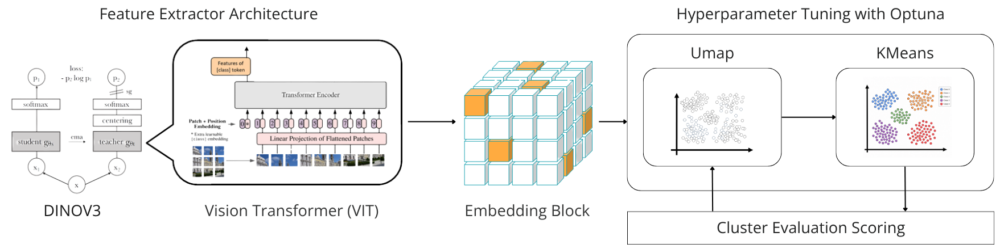

<h2 align="center">Unsupervised Representation Learning untuk Clustering Makanan Nusantara berbasis DINO, UMAP, dan K-Means</h2>

<p align="center">
  <a href="https://www.python.org/downloads/release/python-3110/"></a>
  <a href="https://pytorch.org/get-started/locally/"></a>
  <a href="https://developer.nvidia.com/cuda-toolkit"></a>
  <a href="./LICENSE"></a>
</p>

<p align="center">
  
</p>

Proyek ini menerapkan *unsupervised visual clustering* pada citra makanan Nusantara menggunakan representasi citra dari model DINO pralatih, reduksi dimensi UMAP yang dioptimalkan menggunakan Optuna, serta algoritma K-Means.

Notebook utama tersedia pada [`notebook/final-project-fp-kcv-2026.ipynb`](notebook/final-project-fp-kcv-2026.ipynb).


---

## Daftar Isi

1. [Ringkasan Hasil](#ringkasan-hasil)
2. [Tujuan Penelitian](#tujuan-penelitian)
3. [Struktur Dataset](#struktur-dataset)
4. [Metodologi](#metodologi)
5. [Hasil Eksperimen](#hasil-eksperimen)
6. [Artefak yang Dihasilkan](#artefak-yang-dihasilkan)
7. [Reproduksibilitas](#reproduksibilitas)
8. [Keterbatasan dan Rencana Penelitian Lanjutan](#keterbatasan-dan-rencana-penelitian-lanjutan)
9. [Kesimpulan](#kesimpulan)
10. [Sumber Dataset](#sumber-dataset)

---

## Ringkasan Hasil

Visualisasi utama dari eksperimen DINO ditampilkan pada tabel berikut.

| Embedding UMAP | Distribusi Ukuran Cluster |
|---|---|
| [](image/umap.png) | [](image/cluster_size.png) |

Hasil evaluasi internal pada 4.052 citra pelatihan adalah sebagai berikut:

| Metrik | Nilai |
|---|---:|
| Silhouette coefficient | 0,6714 |
| Davies-Bouldin index | 0,4707 |
| Trustworthiness | 0,9639 |
| Jumlah cluster | 15 |
| Jumlah citra pelatihan | 4.052 |
| Jumlah citra pengujian | 2.056 |

---

## Tujuan Penelitian

Dataset yang digunakan berupa kumpulan citra tanpa label per citra, tetapi memiliki inventaris 15 kemungkinan kategori makanan Nusantara:

1. Ayam Bakar
2. Ayam Betutu
3. Ayam Goreng
4. Ayam Pop
5. Bakso
6. Coto Makassar
7. Gado-Gado
8. Gudeg
9. Nasi Goreng
10. Pempek
11. Rawon
12. Rendang
13. Sate Madura
14. Sate Padang
15. Soto

Eksperimen ini bertujuan menyelidiki apakah kelompok visual yang bermakna secara semantik dapat ditemukan tanpa pelatihan terawasi atau *supervised learning*.

Pipeline eksperimen menghasilkan:

- satu penugasan cluster untuk setiap citra;
- evaluasi kualitas dan separasi cluster;
- analisis kekompakan setiap cluster;
- visualisasi citra representatif pada setiap cluster;
- pemeriksaan citra ambigu atau berada di batas cluster;
- penugasan cluster pada data pengujian secara *out-of-sample*.

Notebook saat ini **tidak mempelajari pemetaan antara ID cluster dan nama makanan**. Dengan demikian, `cluster = 0` merupakan kelompok anonim dan bukan prediksi untuk Ayam Bakar, Ayam Betutu, atau jenis makanan lainnya.

Tahap penyelarasan label atau *label alignment* menggunakan data beranotasi diperlukan sebelum hasil cluster dapat dilaporkan sebagai klasifikasi jenis makanan.

---

## Struktur Dataset

Notebook mengharapkan struktur direktori pada tingkat proyek sebagai berikut:

```text
data/
├── train/
│   ├── *.jpg
│   └── ...
└── test/
    ├── *.jpg
    └── ...
```

Format citra yang didukung meliputi JPG, JPEG, PNG, BMP, WEBP, TIFF, dan TIF. Nama berkas digunakan sebagai pengidentifikasi citra. Notebook tidak menyimpulkan label berdasarkan nama berkas maupun nama direktori.

### Ringkasan Pembersihan Dataset

Loader awal menemukan 4.257 citra pelatihan dan 2.057 citra pengujian. Pemeriksaan kualitas data menghapus 200 citra *placeholder* berukuran 64 × 64 piksel dari data pelatihan, 5 citra duplikat identik dari data pelatihan, dan 1 citra duplikat identik dari data pengujian.

| Split | Jumlah Awal | Setelah Penghapusan *Placeholder* | Setelah Penghapusan Duplikat | Jumlah Akhir |
|---|---:|---:|---:|---:|
| Train | 4.257 | 4.057 | 4.052 | 4.052 |
| Test | 2.057 | 2.057 | 2.056 | 2.056 |

### Audit Data Eksploratif

Analisis data eksploratif mencakup pemeriksaan keterbacaan berkas, dimensi dan rasio aspek citra, statistik warna dan kecerahan, sinyal kualitas citra, hash SHA-256, serta kelompok citra duplikat. Pemeriksaan dilakukan untuk mencegah citra rusak, duplikat, atau *placeholder* sintetis memasuki model representasi.

---

## Metodologi

Pipeline utama terdiri atas beberapa tahap yang digambarkan sebagai berikut:

<p align="center">
  
</p>


### 1. Prapemrosesan Citra

Setiap citra diubah ukurannya menjadi 518 × 518 piksel dan dinormalisasi menggunakan statistik ImageNet:

```text
mean = (0.485, 0.456, 0.406)
std  = (0.229, 0.224, 0.225)
```

Dataloader pelatihan mendefinisikan augmentasi moderat berupa *random resized crop*, pembalikan horizontal, rotasi kecil, *color jitter*, Gaussian blur, dan konversi sesekali menjadi citra skala abu-abu. Ekstraksi fitur menggunakan transformasi evaluasi deterministik sehingga embedding yang disimpan merepresentasikan satu tampilan citra yang konsisten dan dapat direproduksi.

```text
batch_size  = 64
num_workers = 4
image_size  = 518 × 518
```

### 2. Ekstraksi Representasi DINO

Notebook menggunakan backbone DINO pralatih sebagai pengekstrak fitur beku atau *frozen feature extractor*. Kepala klasifikasinya dihapus sehingga model menghasilkan representasi berdimensi 768 untuk setiap citra.

Misalkan keluaran backbone untuk citra $x_i$ dinyatakan sebagai:

```math
f(x_i) \in \mathbb{R}^{768}.
```

Notebook menerapkan normalisasi L2 pada setiap baris embedding:

```math
\hat{f}(x_i)
=
\frac{f(x_i)}{\lVert f(x_i) \rVert_2}.
```

dengan:

```math
\lVert f(x_i) \rVert_2
=
\sqrt{\sum_{j=1}^{768} f_j(x_i)^2}.
```

Embedding disimpan sebagai:

```text
train_embeddings.npy
test_embeddings.npy
```

Tidak ada parameter backbone yang diperbarui selama ekstraksi fitur dan tidak ada label makanan yang digunakan dalam pembentukan representasi.

### 3. Standardisasi dan Optimasi UMAP

Sebelum reduksi dimensi, embedding pelatihan distandardisasi per fitur menggunakan:

```math
z_{ij}
=
\frac{\hat{f}_{ij}-\mu_j}{\sigma_j}.
```

dengan $\mu_j$ sebagai rata-rata fitur ke-$j$ pada data pelatihan dan $\sigma_j$ sebagai simpangan baku fitur ke-$j$ pada data pelatihan. Parameter standardisasi hanya dihitung dari data pelatihan. Scaler yang telah di-*fit* kemudian digunakan untuk mentransformasi embedding data pengujian.

#### Ruang Pencarian UMAP

Hyperparameter UMAP dioptimalkan menggunakan 25 percobaan Optuna:

| Parameter | Ruang Pencarian |
|---|---|
| `n_neighbors` | 5, 10, 15, 30, 50, 100 |
| `min_dist` | Interval kontinu [0, 0,5] |
| `n_components` | 2, 5, 10, 15, 30 |
| `metric` | Euclidean atau cosine |

Pada setiap percobaan, UMAP mentransformasi embedding pelatihan yang telah distandardisasi, K-Means membagi hasil transformasi menjadi $k=15$ kelompok, dan kualitas konfigurasi dievaluasi menggunakan:

```math
J
=
0.45S + 0.45T - 0.10D.
```

dengan $S$ sebagai rata-rata *silhouette coefficient*, $T$ sebagai nilai *trustworthiness*, dan $D$ sebagai *Davies-Bouldin index*.

#### Hyperparameter Terbaik

```text
n_neighbors  = 30
min_dist     = 0.013359822330766435
n_components = 2
metric       = euclidean
objective    = 0.6888347995504066
```

Nilai `min_dist` yang sangat kecil mendorong terbentuknya kelompok lokal yang lebih rapat. Karena konfigurasi terbaik menggunakan `n_components = 2`, model K-Means akhir dijalankan pada koordinat UMAP dua dimensi, bukan secara langsung pada representasi DINO berdimensi 768.

### 4. Clustering dengan K-Means

K-Means dikonfigurasi dengan parameter berikut:

```text
n_clusters   = 15
n_init       = 20
random_state = 3407
```

Diberikan koordinat UMAP $y_i$, K-Means meminimalkan jumlah kuadrat jarak dalam cluster:

```math
\mathcal{L}
=
\sum_{c=1}^{15}
\sum_{i \in C_c}
\lVert y_i-\mu_c \rVert_2^2.
```

dengan $C_c$ sebagai himpunan sampel pada cluster ke-$c$, $\mu_c$ sebagai centroid cluster ke-$c$, dan $y_i$ sebagai koordinat UMAP untuk sampel ke-$i$.

---

## Hasil Eksperimen

### Kualitas Clustering Global

| Metrik | Nilai | Interpretasi |
|---|---:|---|
| Silhouette coefficient | 0,6714 | Menunjukkan separasi rata-rata yang baik dibandingkan dengan kohesi dalam cluster |
| Davies-Bouldin index | 0,4707 | Menunjukkan cluster yang relatif kompak serta terpisah |
| Trustworthiness | 0,9639 | Menunjukkan preservasi lingkungan lokal yang tinggi dari ruang DINO terstandardisasi |

Silhouette coefficient untuk sampel ke-$i$ dihitung menggunakan:

```math
s_i
=
\frac{b_i-a_i}{\max(a_i,b_i)}.
```

dengan $a_i$ sebagai rata-rata jarak sampel ke anggota lain dalam cluster yang sama dan $b_i$ sebagai rata-rata jarak terkecil ke cluster lain.

### Distribusi Cluster Pelatihan

Ukuran cluster pada data pelatihan berkisar antara 183 hingga 335 citra:

```text
cluster  0: 267    cluster  1: 236    cluster  2: 245
cluster  3: 299    cluster  4: 246    cluster  5: 285
cluster  6: 257    cluster  7: 323    cluster  8: 273
cluster  9: 335    cluster 10: 271    cluster 11: 308
cluster 12: 241    cluster 13: 283    cluster 14: 183
```

Ketidakseimbangan ukuran cluster dapat berkaitan dengan variasi visual alami, kondisi pengambilan gambar, latar belakang, pola penyajian, pencahayaan, komposisi citra, atau separasi yang belum sempurna antara makanan dengan karakteristik visual serupa. Ukuran cluster tidak boleh langsung diinterpretasikan sebagai prevalensi kelas makanan karena belum tersedia pemetaan tervalidasi antara cluster dan nama makanan.

### Explainability pada Tingkat Cluster

Untuk setiap cluster, notebook menyimpan:

- sepuluh citra pelatihan yang paling dekat dengan centroid;
- rata-rata dan simpangan baku jarak terhadap centroid;
- rata-rata dan nilai minimum silhouette pada tingkat sampel;
- ukuran cluster;
- proporsi relatif cluster terhadap keseluruhan data.

Informasi tersebut mendukung inspeksi kualitatif terhadap prototipe visual dan tingkat ambiguitas setiap cluster. Citra dengan nilai silhouette rendah atau jarak centroid tinggi perlu diperiksa sebagai kemungkinan sampel batas, *outlier*, atau citra ambigu.

### Inferensi Data Pengujian

Pipeline inferensi mengekstraksi embedding menggunakan backbone DINO yang sama, menstandardisasi embedding menggunakan scaler pelatihan, mentransformasi embedding menggunakan UMAP yang telah di-*fit*, dan menetapkan cluster menggunakan centroid K-Means dari data pelatihan.

Distribusi hasil cluster pada 2.056 citra pengujian adalah:

```text
cluster  0: 105    cluster  1:  78    cluster  2:  85
cluster  3: 198    cluster  4: 151    cluster  5: 235
cluster  6:  85    cluster  7: 201    cluster  8: 182
cluster  9:  84    cluster 10: 143    cluster 11: 129
cluster 12:  86    cluster 13: 151    cluster 14: 143
```

Hasil tersebut merupakan clustering *out-of-sample*, bukan pengukuran akurasi klasifikasi. Accuracy, macro-F1, confusion matrix, precision per kelas, dan recall per kelas belum dapat dihitung karena notebook tidak menggunakan label *ground truth*.

---

## Artefak yang Dihasilkan

```text
output/dinov3/
├── train_embeddings.npy
├── test_embeddings.npy
├── umap_optuna_trials.csv
├── umap_best_params.json
├── umap_best_embedding.npy
├── test_embedding.npy
├── cluster_sizes.csv
├── cluster_sizes.png
├── umap_by_cluster.png
├── hier_kmeans_compare.png
├── cluster_explainability.csv
├── test_predictions.csv
└── cluster_samples/
    ├── cluster_00.png
    ├── cluster_01.png
    ├── ...
    └── cluster_14.png
```

Tabel dan visualisasi audit data eksploratif disimpan pada:

```text
output/eda/
├── tables/
└── figures/
```

Notebook juga menyediakan *interactive cluster browser* untuk inspeksi visual secara lokal. Fitur ini memerlukan `ipywidgets`.

---

## Reproduksibilitas

Notebook menetapkan seed berikut:

```python
SEED = 3407
```

Seed digunakan untuk NumPy, modul `random` Python, UMAP, dan K-Means. Lingkungan PyTorch dengan dukungan CUDA direkomendasikan untuk mempercepat ekstraksi representasi citra.

```text
Python  : 3.11
PyTorch : 2.8.0
CUDA    : 12.8
GPU     : NVIDIA GeForce RTX 4060
```


Reproduksibilitas numerik secara persis masih dapat dipengaruhi oleh perbedaan perangkat keras, implementasi kernel CUDA, versi pustaka, versi driver, revisi bobot pralatih, dan operasi yang tidak sepenuhnya deterministik.

### Menjalankan Notebook

Jalankan notebook dari direktori utama proyek agar path berikut dapat diakses dengan benar:

```text
data/
output/
notebook/
```

### Dependensi Utama

```text
torch
torchvision
timm
numpy
pandas
Pillow
opencv-python
seaborn
matplotlib
scikit-learn
umap-learn
optuna
ipywidgets
```

---

## Keterbatasan dan Rencana Penelitian Lanjutan

### 1. Belum Tersedia Penyelarasan Label Semantik

Kelima belas ID cluster belum dipetakan ke nama makanan. Penelitian selanjutnya dapat melakukan penyelarasan menggunakan subset kalibrasi beranotasi, algoritma Hungarian, model citra-teks, atau anotasi manual prototipe cluster.

### 2. Belum Tersedia Evaluasi Prediktif Eksternal

Metrik internal hanya mengevaluasi struktur geometris clustering dan tidak mengukur kemampuan model mengenali jenis makanan. Benchmark berlabel yang benar-benar dipisahkan diperlukan untuk menghitung accuracy, macro-F1, precision, recall, confusion matrix, dan performa per kategori.

### 3. Clustering Dilakukan Setelah Proyeksi Nonlinier

K-Means diterapkan pada ruang UMAP dua dimensi. Pendekatan ini mempermudah visualisasi dan dapat menonjolkan struktur lokal, tetapi UMAP dapat mengubah hubungan jarak global pada representasi asli. Eksperimen lanjutan sebaiknya mencakup K-Means langsung pada embedding DINO berdimensi 768, PCA dilanjutkan K-Means, UMAP berdimensi lebih besar, analisis sensitivitas terhadap nilai $k$, serta perbandingan kualitas sebelum dan sesudah reduksi dimensi.

### 4. Potensi Faktor Visual Pengganggu

Kemiripan representasi DINO dapat dipengaruhi latar belakang, jenis piring atau wadah, gaya penyajian, pencahayaan, sudut pengambilan gambar, komposisi crop, sumber citra, dan kualitas kamera. Audit terstratifikasi dan pembagian data yang mempertimbangkan sumber citra dapat membantu mengukur pengaruh faktor tersebut.

### 5. Penggunaan Satu Backbone dan Satu Kali Eksperimen

Ketahanan hasil dapat diuji dengan membandingkan beberapa ukuran model DINO, encoder pralatih lain, algoritma clustering alternatif, beberapa random seed, dan beberapa konfigurasi reduksi dimensi. Alternatif yang dapat diuji meliputi Agglomerative Clustering, Gaussian Mixture Model, HDBSCAN, Spectral Clustering, dan BIRCH.

---

## Kesimpulan

Pipeline ini menunjukkan bahwa representasi citra pralatih berbasis DINO, reduksi dimensi UMAP, dan K-Means dapat menghasilkan kelompok visual yang relatif kompak dan terpisah pada dataset makanan Nusantara tanpa menggunakan label selama ekstraksi fitur maupun clustering.

Eksperimen menghasilkan silhouette coefficient sebesar 0,6714, Davies-Bouldin index sebesar 0,4707, dan trustworthiness sebesar 0,9639 pada 4.052 citra pelatihan. Hasil tersebut menunjukkan bahwa struktur lokal representasi dapat dipertahankan dengan baik dan menghasilkan pemisahan cluster yang cukup kuat.

Meskipun demikian, hasil clustering belum dapat diinterpretasikan sebagai klasifikasi jenis makanan. Penyelarasan semantik menggunakan data beranotasi serta evaluasi pada benchmark berlabel tetap diperlukan sebelum ID cluster dapat dikaitkan dengan kategori makanan tertentu.

---

## Sumber Dataset

Dataset tersedia melalui [Data Mining Action 2025 di Kaggle](https://www.kaggle.com/competitions/data-mining-action-2025) atau https://drive.google.com/drive/folders/1YxRQlW46bSU0lQH9latqMkKktw_wFQjh?usp=sharing
